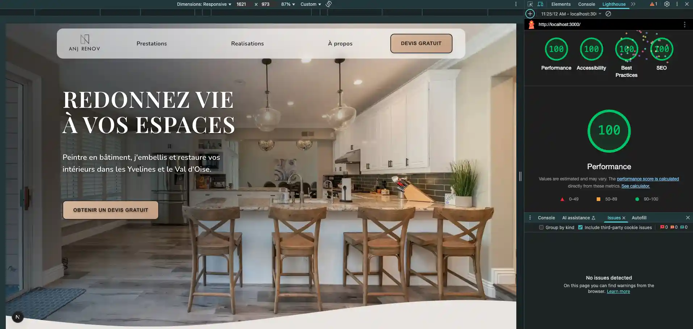

🇪🇸 Este README está disponible únicamente en inglés para facilitar la comprensión técnica.

🇫🇷 Ce README est disponible uniquement en anglais pour garantir une meilleure lisibilité technique.  

  

ANJ Renov – Corporate Website (Next.js 15 + TypeScript)

This project is a marketing site for **ANJ Renov**, a family‑owned painting & renovation business in France.  
The goal was to deliver an elegant, fast, accessible and SEO‑friendly experience while showcasing the company’s services and craft.

---

## 🚀 Tech Stack

| Layer                | Tools & Libraries                                 |
| -------------------- | ------------------------------------------------- |
| **Framework**        | Next.js 15 (App Router)                           |
| **Language**         | TypeScript                                        |
| **Styling**          | Vanilla CSS Modules (scoped per component)        |
| **Fonts**            | Playfair Display (headings)  •  Nunito (body text) |
| **Images & media**   | `next/image`, SVG icons                           |
| **Deployment**       | Vercel                                            |

Key performance features:
- Server‑side rendering (SSR) for first‑class SEO  
- Lazy loading with `Suspense` & `next/dynamic`  
- Optimised images (`<Image>` component, WebP, responsive sizes)

---

## 🧰 Tools I Used
ESLint + Prettier – Linting & formatting

Framer Motion – Smooth UI animations (framer-motion@12.7.4)

React Hook Form – Lightweight form handling with validation (react-hook-form@7.56.4)

Nodemailer – Server-side email handling (nodemailer@7)

Chrome DevTools + Lighthouse – Performance & accessibility auditing

Vercel – Seamless deployment & serverless backend

GitHub – Version control and collaboration

---

## 🔒 Security & Accessibility Highlights


- Client and server-side input validation on forms
- Semantic HTML with ARIA roles and landmark tags
- Full keyboard navigation support with visible focus styles
- Descriptive alt texts on all images
- Color contrast complies with WCAG 2.1 AA
- Scalable text using rem units for font sizes
- Contact form uses accessible labels and real-time validation messages
- Tested with VoiceOver (screen reader) and Lighthouse Accessibility Audit

---

## 📁 Project Structure
```
app/
├── components/ # Re‑usable UI pieces (sliders, counters, CTA buttons…)
│ ├── gallery/
│ ├── parallax-card/
│ └── ...
├── sections/ # Page sections rendered on the server (SSR)
│ └── sections-home/
│ ├── sections-about/
│ └── ...
├── data/ # Static content (TSX objects)
│ ├── data.tsx
│ └── projects.tsx
├── lib/ # Hooks, server actions, models and types
│ ├── hooks/
│ ├── actions/
│ └── models/
└── public/ # Images, SVGs
```
- **Sections** fetch data from `/data` and compose UI from `/components`.  
- Components default to **SSR** for SEO; interactive pieces use **CSR** via `dynamic()`.

---

## ✨ Main Features

- Responsive design, mobile‑first
- Animated counters, parallax cards, mask reveal..
- Image gallery with lazy‑loaded modal slider
- Comparison chart (artisan vs. big company vs. low‑cost painter)
- Contact form with validation & error messages
- Fully accessible (semantic HTML, alt tags, colour contrast)

---

## 🧠 What I Learned

- How to structure a modern Next.js 15 project using the App Router and Server Actions
- Implementing best practices for SSR, lazy loading (`Suspense`, `next/dynamic`), and code splitting
- Enhancing accessibility through semantic HTML, color contrast, descriptive alt text, and full keyboard (Tab) navigation support.
- Deploying a production-ready app on Vercel and debugging common deployment issues
  
---

## 💾 Getting Started Locally

```bash
git clone https://github.com/YOUR-USER/anj-renov.git
cd anj-renov
npm install
npm run dev        # http://localhost:3000
```

---

## 📈 Lighthouse Scores


**Tested locally** on `localhost:3000` using Chrome Lighthouse  
Environment: Desktop, no throttling, production build



---

## 📌 Planned Improvements

- Add spam protection (Honeypot / reCAPTCHA)
- Animate route transitions with `View Transitions` 
- Add tests with `vitest` or `playwright`

---

## 🔗 Live Demo & Contact

[](https://renov-three.vercel.app/)

Built with 💙 by [Aurélie](https://aurelie-nogueira.vercel.app/)
👉 [LinkedIn](https://linkedin.com/in/aurelie-nogueira) • [GitHub](https://github.com/aurelienog)

---

## 📄 License

  
This project is licensed under **All Rights Reserved**.  
Please do not reuse or distribute the code without permission.  